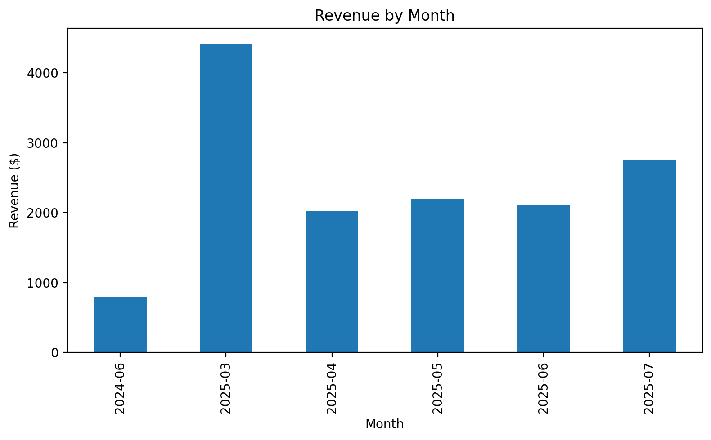
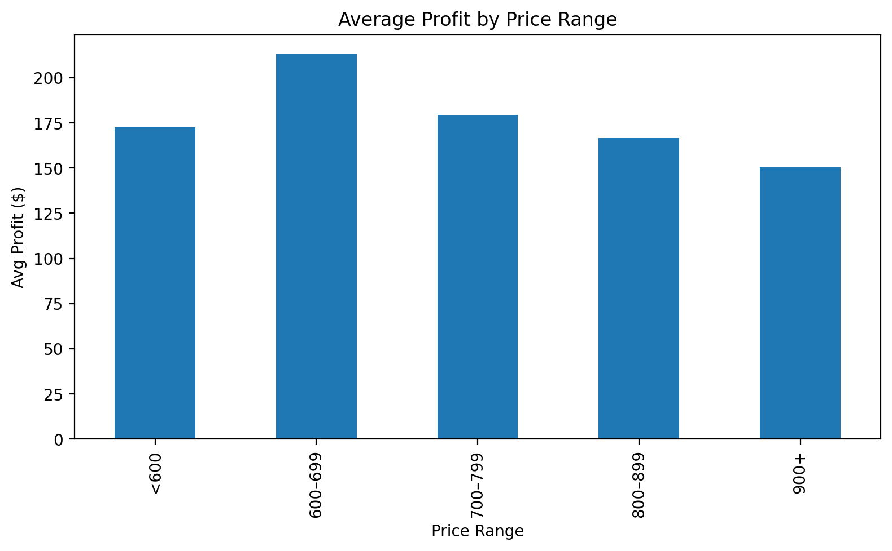
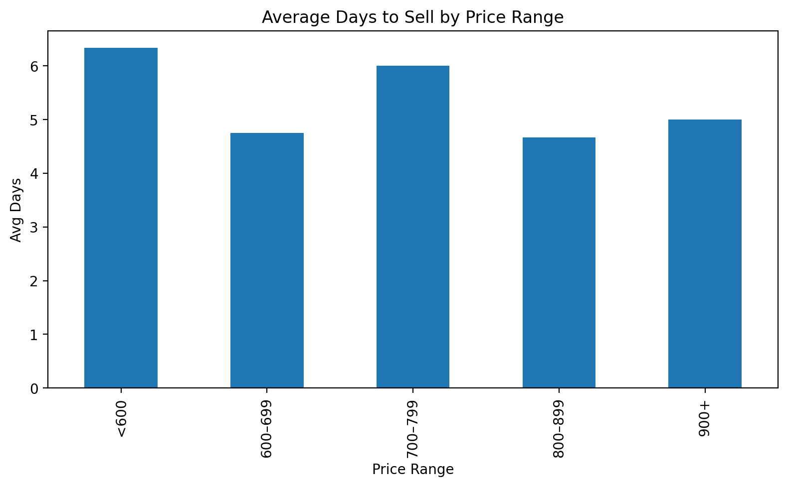
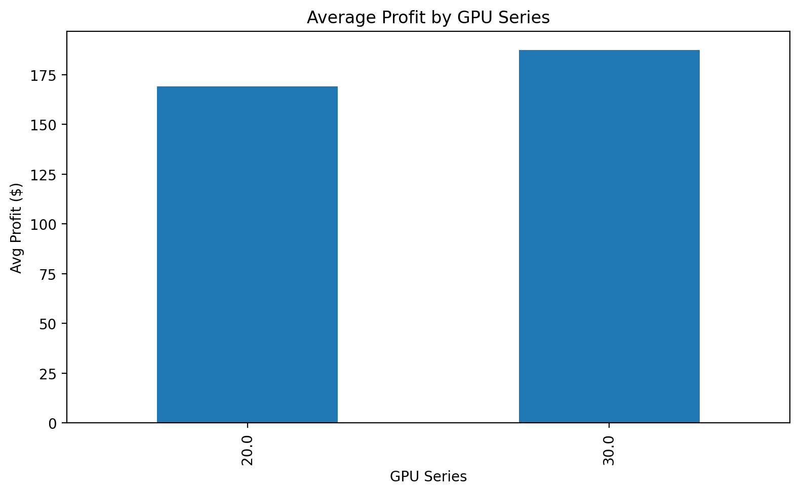
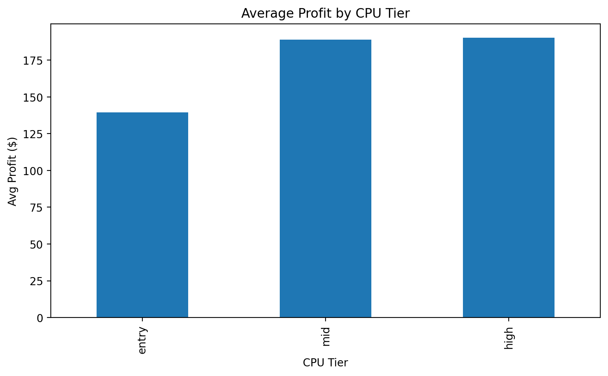
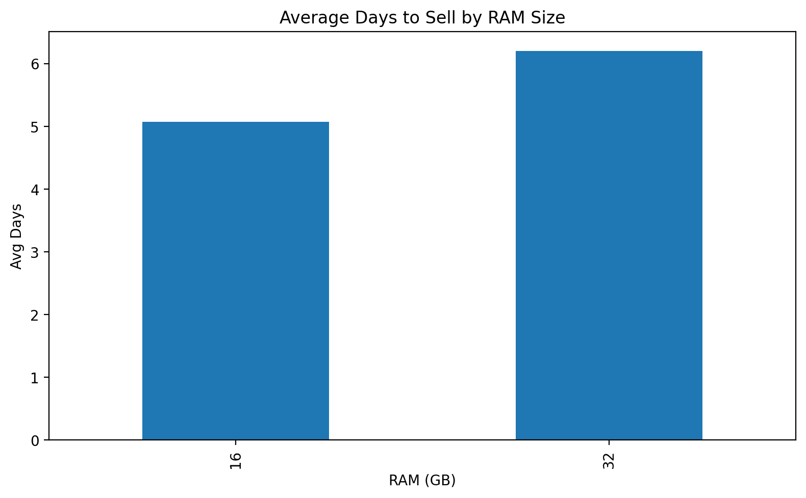

# HanoPCs Sales Analysis & Optimization (SQL + Python)

## Overview
This project analyzes real PC sales data for a small PC reselling business to evaluate profitability, pricing efficiency, and time-to-sale. The analysis combines relational database design, SQL querying, Python-based optimization, and dashboard-style visualizations to generate actionable business insights.

---

## Dataset
- 20 PC sales from March–July 2025  
- Sale dates were approximated due to missing exact timestamps  
- Metrics include total price, cost, profit, days-to-sell, and component attributes

---

## Key Questions
- How long do PCs take to sell on average?
- Does higher profit impact time-to-sale?
- What price range maximizes profit without slowing sales?
- Which hardware components drive higher profit and faster turnover?

---

## Key Findings
- Average profit per PC: **~$180**
- High-margin builds (>$200) averaged **$242.58** in profit
- Average time-to-sale was **~5 days**
- Higher margins did **not** meaningfully increase selling time
- Builds priced **$600–699** achieved the best balance of profit and sales speed
- RTX 30-series GPUs and higher-tier CPUs correlated with higher profit and faster sales

---

## Tools & Technologies
- SQLite
- SQL (aggregations, filtering, JOINs)
- Python (pandas, matplotlib)
- DB Browser for SQLite
- Jupyter Notebook

---

## Pricing Optimization (Python)
After completing the SQL analysis, the SQLite database was loaded into Python using pandas to further evaluate pricing strategy. Prices were grouped into ranges to identify an optimal balance between profit and time-to-sale.

The analysis showed that PCs priced between **$600–699** achieved the highest average profit (~$213) while also selling faster than most other price ranges (~4.8 days), identifying this range as the pricing sweet spot.

---

## Component-Level Performance Analysis (SQL JOINs)
To understand how hardware choices affect outcomes, a relational `builds` table was created and joined with the `sales` table using SQL. Component attributes such as GPU tier/series, RAM size, and CPU tier were analyzed against profit and days-to-sell.

Results showed that **RTX 30-series GPUs** generated higher average profit and sold faster than RTX 20-series builds, while **higher-tier CPUs** correlated with both increased profit and quicker sales. Increasing RAM from 16 GB to 32 GB provided minimal profit improvement and slightly slower turnover.

---

## Dashboard (Python)

### Revenue & Profit Over Time

### Pricing Optimization

### Component Performance

---

### Monthly performance (SQL → Python)

### Pricing optimization

### Component-level analysis (SQL JOINs)

