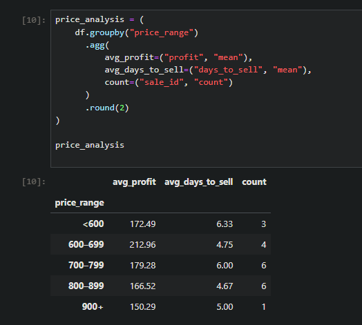
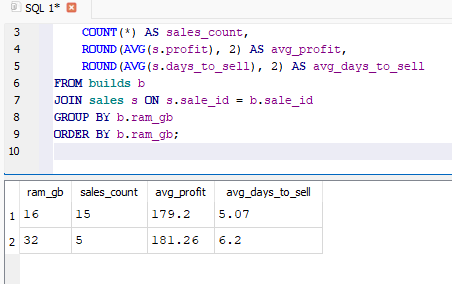
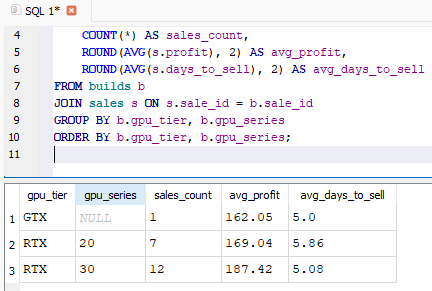
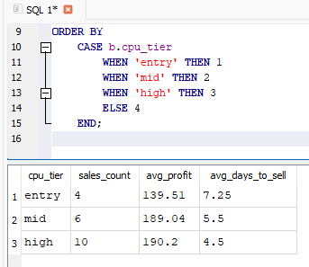

## Screenshots

### Monthly performance summary

### Overall averages & high-profit comparison (SQL)

### Sales table schema

### Pricing optimization (Python)

### Component-level analysis (SQL JOINs)

